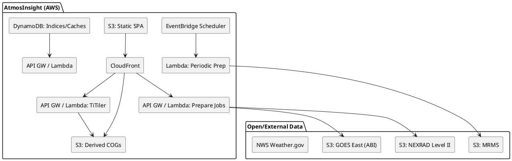

# SPEC-1-AtmosInsight

## Background

AtmosInsight is an AWS‑native, living atlas of the atmosphere and near‑space. It aggregates real‑time and recent historical signals—severe‑weather alerts, radar (mosaic + single‑site), GOES satellite imagery, lightning (later), fire detections, air quality, hydrologic/ocean data, and space‑weather indicators—into a trusted, fast experience. Each layer ships with units, legends, timestamps, provenance, attribution, update cadence, and caveats. The platform favors AWS for ingest, processing, storage, and delivery to keep cost low, performance high, and operations simple. It is transparent about uncertainty (data gaps, latency) and designed to be sustainable and extensible.

## Requirements (MVP)

**Scope**
- Regions: CONUS, Alaska, Hawaii.
- Time: real‑time + rolling archives (heavy raster: 7 days; lightweight metadata: 30 days).
- Layers (MVP): NWS alerts; NEXRAD radar (national mosaic + single‑site); GOES‑East/CONUS ABI Band 13; (GLM lightning deferred); fire detections (later); EPA AQI observations; headline space‑weather indices.
- Access model: Public, no‑login viewing; optional sign‑in for saved views; rate‑limited read‑only API.

**SLOs & Budget**
- Traffic: ~5–10k map/API requests per month (hobby scale), peak ≤2 RPS.
- Performance: p95 tile/image fetch ≤600 ms from edge; p95 initial load ≤3 s.
- Availability: 99.5% monthly with graceful degradation on stale data.
- Cost guardrail: ≤ $30/month infra spend.

**Non‑functional**
- Observability: basic metrics/logs, cost dashboard, public status page (later).
- Security: least‑privilege IAM; no PII; dataset license compliance.

## Method

### Core delivery pattern (server‑rendered tiles)

- Raster tiling via **TiTiler on AWS Lambda** behind API Gateway → CloudFront.
- Data reads from AWS Open Data buckets when available; derived COGs stored in our S3 with lifecycle (7 days) to stay within budget.
- Immutable keys for strong CDN caching; long TTLs; honest timestamps and gap indicators in UI.



---

### Radar — Single‑Site Tiling (**Locked**)

**Decisions**
- Product: NEXRAD **Level II Reflectivity, Tilt 0 (super‑res)**.
- Zooms: **z5–z12**, 256×256 PNG XYZ tiles (Web Mercator).
- Pipeline: **Level II → grid → COG → TiTiler (Lambda) → CloudFront**.
- Retention: Derived COGs auto‑expire after **7 days**.
- Provenance: Tile responses include headers; `/radar/meta/{site}/{time}.json` supplies legend/units/timestamp.

**S3 Layout**
```
s3://atmosinsight-derived/
  derived/nexrad/{site}/{yyyymmddHHMMssZ}/
    tilt0_reflectivity.tif  # COG
    meta.json               # {units:"dBZ", palette:"nexrad_reflectivity", volume_time, ...}
```

**APIs**
- `POST /radar/prepare?site=KTLX&time=2025-09-09T01:20:00Z`
- `GET  /tiles/radar/{site}/{time}/{z}/{x}/{y}.png`
- `GET  /radar/meta/{site}/{time}.json`

**Acceptance**
- Prepare ≤10 s cold; ≤2 s warm. Tiles stitch at z8–z12. p95 tile fetch ≤600 ms warm.

---

### Satellite — GOES ABI Band 13 (CONUS) (**Locked**)

**Decisions**
- Frames: **last 12** (~1 hour), lazy‑hydrated on first view.
- Units: **Kelvin** default; UI toggles to **°C** and **°F**.
- Styling: Default rescale **180–330 K**; PNG tiles.

**S3 Layout**
```
s3://atmosinsight-derived/
  derived/goes/east/abi/c13/conus/{yyyymmddTHHMMSSZ}/
    bt_c13.tif
    meta.json                # {units:"K", rescale:[180,330], band:13, sector:"CONUS", ...}
  indices/goes/east/abi/c13/conus/index.json   # last 12 timestamps
```

**APIs**
- `POST /goes/prepare?band=13&sector=CONUS&time=latest|UTC`
- `GET  /tiles/goes/abi/c13/conus/{time}/{style}/{z}/{x}/{y}.png`
- `GET  /goes/timeline?band=13&sector=CONUS&limit=12`

**Acceptance**
- Prepare ≤10 s cold; ≤2 s warm. Correct units/legend/timestamp; conversions exact. p95 tile fetch ≤600 ms warm.

---

### Radar — National Mosaic (MRMS) (**Locked**)

**Decisions**
- Product: **MergedReflectivityQComposite (dBZ)**.
- Coverage: **CONUS** (Alaska/Hawaii hidden for mosaic; single‑site layer still available there).
- Cadence/Frames: Fetch every **5 min**; keep **last 12** frames (~1 hour).
- Zooms: **z4–z10** PNG tiles for national‑scale clarity.
- Styling: Same NEXRAD reflectivity palette and dBZ legend as single‑site for visual continuity.

**Pipeline**
- **EventBridge** → `mrms-prepare(latest)` every 5 min.
- `mrms-prepare` reads latest MRMS mosaic → GeoTIFF → **COG**; writes to S3 and updates an `index.json` ring buffer.
- **TiTiler (Lambda)** serves PNG tiles; CloudFront caches with long TTLs.

**S3 Layout**
```
s3://atmosinsight-derived/
  derived/mrms/reflq/{yyyymmddTHHMMZ}/
    mosaic.tif
    meta.json
  indices/mrms/reflq/index.json
```

**APIs**
- `POST /mosaic/prepare?product=reflq&time=latest|UTC`
- `GET  /tiles/mosaic/reflq/{time}/{z}/{x}/{y}.png`
- `GET  /mosaic/timeline?product=reflq&limit=12`

**Acceptance**
- Newest frame available ≤2 min after publish; tiles stitch at z4–z10; dBZ legend and timestamps correct.

---

### NWS Alerts — Static MVT on S3 (**Locked**)

**Decisions**
- Delivery: **Static Mapbox Vector Tiles (MVT)** baked every few minutes and hosted on **S3 + CloudFront**.
- Coverage: **CONUS + Alaska + Hawaii + coastal/marine zones**.

**Data & join strategy**
- Fetch **active alerts** from `api.weather.gov/alerts/active` (GeoJSON). Use polygon **geometry** when present. When an alert references **UGC zone codes** without polygons, join against cached **zone geometries** from `api.weather.gov/zones` (types: land, marine, coastal). Keep a nightly‑refreshed zone geometry cache in S3 to avoid repeated API calls.

**Generation cadence**
- **EventBridge schedule every 5 minutes** triggers `alerts-bake` Lambda.

**`alerts-bake` Lambda steps**
1) GET all active alerts (paginate if needed).
2) Normalize per‑feature properties (see schema below); compute **display severity** and **staleness** flags.
3) Merge geometries: prefer alert polygon; else dissolve referenced zones into a single polygon per alert.
4) Emit a temporary **GeoJSON** and run **Tippecanoe** (via Lambda container image) to create a directory of **.pbf** tiles at z3–z12.
5) Upload to S3 under `/tiles/alerts/{yyyymmddTHHMMZ}/...` with `Content-Type: application/vnd.mapbox-vector-tile` and `Content-Encoding: gzip`.
6) Update `indices/alerts/index.json` with the latest timestamp and atomically switch the **"latest"** pointer (a tiny JSON the frontend reads to determine the current tile path).

**Vector tile schema (lean for fast maps)**
- Layer: `alerts`
- Properties in‑tile (for styling/filtering):
  - `id` (NWS identifier), `event` (e.g., Tornado Warning), `severity` (Extreme/Severe/Moderate/Minor/Unknown), `urgency` (Immediate/Expected/etc.), `certainty` (Observed/Likely/etc.), `status` (Actual/Test), `sent` (ISO8601), `ends` (ISO8601 or null), `area` (short areaDesc), `ugc` (comma‑joined codes), `marine` (bool).
- Heavier text (full headline, instruction, description) is fetched on demand by **detail API** using `id` to keep tiles tiny.

**Styling & legend**
- Default fill/outlines keyed by **severity** with accessible palette; dashed outlines for **Watch**, solid for **Warning**, dotted for **Advisory/Statement** (derived from `event`).
- Layer metadata panel shows **timestamp of bake**, **update cadence (5 min)**, **provenance/attribution**, and caveats about zone vs. polygon alerts.

**Zooms**
- **z3–z12** to match your other layers; geometries are simplified progressively by Tippecanoe.

**S3 Layout**
```
s3://atmosinsight-derived/
  tiles/alerts/{yyyymmddTHHMMZ}/
    {z}/{x}/{y}.pbf
  tiles/alerts/{yyyymmddTHHMMZ}/tile.json   # TileJSON for discovery
  indices/alerts/index.json                 # {latest: "{yyyymmddTHHMMZ}", history:[...]}
```

**APIs**
- Static tiles via CloudFront: `/tiles/alerts/{yyyymmddTHHMMZ}/{z}/{x}/{y}.pbf`.
- A tiny helper endpoint `/alerts/latest` returns the current timestamp so the frontend can build the tile URL; alternatively, frontend reads `indices/alerts/index.json` from S3.
- `/alerts/detail/{id}` (optional Lambda) proxies to `api.weather.gov/alerts/{id}` for full text/details.

**Acceptance**
- New tileset every **≤5 min**; size of TileJSON ≤50 KB; typical tile payload ≤30 KB at z6–z10.
- Styling switches by severity/watch/warn/advisory; selecting a feature loads detail text by `id`.
- Gap indicator shown if no refresh for >10 min.

---

## Implementation (phase 1 — the three locked layers)

1) **Infra**: **us-east-1** for S3 (static + derived), Lambda, API Gateway, EventBridge, DynamoDB. CloudFront is global but uses **ACM (N. Virginia/us-east-1)** certs.
2) **Deploy TiTiler (Lambda)**: allowlist our derived bucket; memory 1536–3008 MB; timeout 10 s.
3) **Radar single‑site**: build `radar-prepare` Lambda with Py‑ART/xradar; grid tilt 0; COGify; write meta+COG; expose meta endpoint.
4) **GOES C13**: build `goes-prepare` Lambda; extract `CMI` from CMIPC; COGify; index ring buffer (12 frames); expose timeline endpoint.
5) **MRMS mosaic**: build `mrms-prepare` Lambda on EventBridge 5‑min schedule; write COG+meta; update index.
6) **Frontend** (MapLibre): layer toggles; per‑layer legends/units/timestamps; time slider scrubs ABI/MRMS timelines; site‑picker for single‑site radar.
7) **Observability**: CW logs + metrics; simple health endpoint; public status badge; cost dashboard.

---

### Deployment — Region & Domain (**Locked**)

**Region**
- All AWS resources in **us-east-1** (N. Virginia). Required for CloudFront’s ACM certificate attachment.

**Domain**
- Public hostname: **`weather.westfam.media`**.

**DNS model (chosen)** — *Delegate subdomain to Route 53*
1) **Route 53** → create a **public hosted zone** `weather.westfam.media` (us-east-1). Note the 4 NS records it provides.
2) **Cloudflare** (authoritative for `westfam.media`) → create **NS records** for the subdomain:
   - Name: `weather`
   - Type: `NS`
   - Value: the 4 Route 53 NS names
   - Proxy status: DNS‑only (Cloudflare will not proxy NS).
3) **ACM (us-east-1)** → request a cert for `weather.westfam.media` (and optionally `*.weather.westfam.media` for future APIs). Choose **DNS validation**; ACM will create CNAMEs in the Route 53 hosted zone.
4) **CloudFront distribution** (`cf-main`) → set **Alternate Domain Names (CNAMEs)** to `weather.westfam.media`; attach the ACM cert.
5) **Route 53 alias** → in the `weather.westfam.media` hosted zone, create an **A/AAAA ALIAS** at the **root** pointing to the CloudFront distribution.
6) Validate: `dig weather.westfam.media` resolves to CloudFront; HTTPS shows the ACM cert.

**CloudFront origins & behaviors**
- Origins:
  - `static-s3` → S3 (`atmosinsight-static`) for SPA, **PMTiles**, styles, sprites, fonts.
  - `api-gw` → API Gateway for Lambda endpoints (`/tiles`, `/prepare`, `/healthz`).
- Behaviors (examples):
  - `/basemaps/*` → `static-s3`; **forward `Range` header**; cache policy: min 0 / default 1h / max 24h; compress on.
  - `/styles/*`, `/sprites/*`, `/fonts/*` → `static-s3`; standard static caching.
  - `/tiles/*`, `/mvt/*` → `api-gw`; cache based on path + query; allow GZIP; longer TTLs for immutable timestamps.
  - `/healthz` → `api-gw`; **bypass cache** (min=0, max=0).
- Security: enable **Origin Access Control (OAC)** for `static-s3`; block direct S3 public access; WAF attached to the distribution.

**Alternative DNS (not chosen, for reference)** — keep Cloudflare authoritative
- Keep the zone on Cloudflare; **CNAME** `weather.westfam.media` → CloudFront domain. Validate ACM via Cloudflare DNS. Caveat: Cloudflare’s orange‑cloud proxy can interfere with **Range** requests and caching; use **DNS‑only** if you go this route.

---

### Basemap — CyclOSM (execution plan)

**Status**: You are downloading **OpenMapTiles Planet MBTiles** now. We will **convert to a single PMTiles** (z0–15) and host on S3+CloudFront.

**Exact steps**
1) Convert: `pmtiles convert planet.mbtiles planet.z15.pmtiles`.
2) Upload to `s3://atmosinsight-static/basemaps/planet.z15.pmtiles` with metadata:
   - `Content-Type: application/octet-stream`
   - `Access-Control-Allow-Origin: *`
3) CloudFront distro (origin = S3 static):
   - Cache policy forwards **Range** header; minimum TTL 0, default 1h, max 24h.
   - Enable compression for JSON/JS/CSS; PMTiles stays binary.
4) Upload **CyclOSM style, sprites, glyphs** into `styles/`, `sprites/cyclosm/`, `fonts/` (per layout in this SPEC).
5) MapLibre init loads `styles/cyclosm.json`; confirm z0–z15; verify attributions.

---

### Beta Launch Checklist (**MVP First Pixels**)

**AWS plumbing**
- [ ] S3 buckets: `atmosinsight-static` (SPA + PMTiles + styles/sprites/fonts), `atmosinsight-derived` (COGs + indices).
- [ ] CloudFront: two origins (Static S3, API Gateway). **Range** forwarded on static origin only.
- [ ] **ACM cert (us-east-1)** for `weather.westfam.media`; CloudFront alt domain set; HTTPS green.
- [ ] **Route 53 hosted zone** for `weather.westfam.media` created; Cloudflare **NS delegation** configured.
- [ ] API Gateway + Lambdas deployed: `tiler`, `radar-prepare`, `goes-prepare`, `mrms-prepare`, `alerts-bake`, `healthz`.
- [ ] EventBridge rules: MRMS (5‑min), Alerts (5‑min).
- [ ] DynamoDB (optional) for indices/caches; otherwise S3 indices only.

**Data layers**
- [ ] **Basemap**: `planet.z15.pmtiles` live via CloudFront; CyclOSM style renders correctly.
- [ ] **Single‑site radar**: prepare → tiles; legend (dBZ) + timestamp visible.
- [ ] **GOES C13**: last 12 frames prepared on-demand; Kelvin/°C/°F toggle works.
- [ ] **MRMS mosaic**: last 12 frames on 5‑min cadence; dBZ legend aligned with single‑site.
- [ ] **NWS Alerts**: MVT tiles baked every 5 min; severity styling; detail fetch by `id`.

**UX**
- [ ] Time slider: 5 FPS; as‑of join ±3 min; gap ticks; stale watermark.
- [ ] Accessibility: keyboard shortcuts; legends readable; color-vision‑friendly.
- [ ] Attribution footer: OSM + CyclOSM + NOAA/NWS/GOES/MRMS as applicable.

**Ops**
- [ ] `/healthz` returns green; shows newest ages for ABI/MRMS/Alerts.
- [ ] API GW throttle + WAF rule active; 429s tested.
- [ ] AWS Budget alarms at $20/$25/$30; CloudWatch dashboards for Lambda durations and error rates.

**Exit criteria**
- [ ] p95 tile latency ≤600 ms warm from CloudFront on a sample route.
- [ ] Weekly spend projection ≤$30/mo with <6 users.

---

### Basemap — CyclOSM via OpenMapTiles PMTiles (**Locked**)

**Decisions**
- **Path**: **Static PMTiles on S3 + CloudFront** (no tile server).
- **Coverage**: **Full planet** (user preference) packaged as a single PMTiles (or a small set, see below).
- **Max zoom**: **z15**.
- **Aesthetic**: Use **CyclOSM** Mapbox‑GL style (archived) adapted for MapLibre; keep the classic cycle cartography.
- **Fonts**: **Noto Sans** SDF glyphs at launch.
- **Sprites**: **CyclOSM sprite sheet as‑is** for fidelity.

**Planet‑scale packaging**
- Primary artifact: `planet.z15.pmtiles` hosted on S3 and fronted by CloudFront with **Range request** support enabled.
- Optional split (if size or upload time becomes painful):
  - `planet.z0-10.pmtiles` (global low/mid zoom)
  - `north-america.z11-15.pmtiles` (regional high zoom)
  - Client style declares two sources and switches by zoom; visually identical but keeps individual files smaller.

**Data & build strategy**
- **Acquire**: download **OpenMapTiles Planet MBTiles** (if available under your license) → `pmtiles convert` → upload.
- **Build** (DIY): run the **OpenMapTiles/Planetiler** pipeline on an ephemeral EC2 (spot), using planet PBF → MBTiles (OpenMapTiles schema) → PMTiles.
  - Suggested build box: 16–32 vCPU, 64–128 GiB RAM, **1–2 TiB gp3** SSD. Keep EBS temporary; destroy after build.
  - Target output (z0–15 vector): on the order of **100–300+ GiB**, depending on schema/layers retained.

**Hosting (AWS)**
- **S3** bucket `atmosinsight-static` for PMTiles, style, sprites, glyphs.
- **CloudFront**: cache policy must **forward the `Range` header**; enable large object caching.
- CORS headers for **fonts/sprites/style/pmtiles**: `Access-Control-Allow-Origin: *`.
- Attribution footer (always visible): `© OpenStreetMap contributors (ODbL). Style © CyclOSM (CC‑BY‑SA 2.0).`

**S3 layout**
```
s3://atmosinsight-static/
  basemaps/
    planet.z15.pmtiles
    (optional)
    planet.z0-10.pmtiles
    north-america.z11-15.pmtiles
  styles/
    cyclosm.json
  sprites/cyclosm/
    cyclosm.json
    cyclosm.png
    cyclosm@2x.json
    cyclosm@2x.png
  fonts/
    Noto Sans Regular/0-255.pbf
    Noto Sans Italic/0-255.pbf
    (... more ranges)
```

**Style wiring (MapLibre)**
- Base: CyclOSM GL style adapted to our sources.
- Single‑file case:
```json
{
  "version": 8,
  "sources": {
    "osm": {
      "type": "vector",
      "url": "pmtiles://https://cdn.atmosinsight.org/basemaps/planet.z15.pmtiles"
    }
  },
  "sprite": "https://cdn.atmosinsight.org/sprites/cyclosm/cyclosm",
  "glyphs": "https://cdn.atmosinsight.org/fonts/{fontstack}/{range}.pbf"
}
```
- Split‑file case: declare `osm_low` (z≤10) and `osm_hi` (z≥11) and use `minzoom/maxzoom` on layers to switch seamlessly.

**Ops playbook**
1) **Acquire or build** MBTiles (planet, OpenMapTiles schema).
2) `pmtiles convert planet.mbtiles planet.z15.pmtiles`; validate with `pmtiles inspect`.
3) Upload to S3 using **multipart upload**; set metadata: `Content-Type: application/octet-stream`, `Access-Control-Allow-Origin: *`.
4) CloudFront: enable **Range**, set long TTL, and tune cache key for `Range`.
5) Smoke test zooms 0–15 globally; verify cycleway rendering, label density, and sprite glyphs.

**Acceptance**
- z0–z15 global renders with CyclOSM styling; p95 vector fetch ≤600 ms warm; no failed range requests; attribution displayed.

---

## Frontend — Time Slider & Layer Sync (**Locked**)

**Model (formalized, hobby-friendly)**
- **Temporal registry**: each layer with time series exposes a compact `index.json` (sorted ISO8601 list, newest first) plus `meta` (cadence, latency hints).
- **Reference layer**: the slider binds to one **reference** (default **ABI C13** when visible). Its `index.json` defines the slider ticks.
- **As-of temporal join**: for every visible non-reference layer, pick the **nearest** frame to the slider time `t` using an **as-of join** with tolerance **±3 minutes**; if no candidate exists, the layer enters **degraded** state (grayed) and surfaces a tooltip "no frame near t".
- **Watermark**: treat a layer as **stale** if `now - newest_timestamp > 10 minutes`; show a badge and pause autoplay if the reference layer is stale.

**Playback**
- **5 FPS** animation over the **last 12 frames** (≈1 hour for ABI/MRMS) with prefetch of **next 2 frames** per visible layer.
- Keyboard: `space` play/pause, `[`/`]` step, `L` jump-to-latest.

**Prefetch & caching**
- Tiles use immutable timestamped URLs → CloudFront long-TTL cache. The player prefetches the next two timestamps per layer and cancels on pause or scrub.

**Failure/gaps**
- Gap ticks render when `index.json` misses expected timestamps; playback skips gaps by default and can be set to pause-on-gap.

**Future (bookmarked)**
- **Smoother motion** via optional **temporal interpolation**: cross-fade or vector-warp between frames (kept out of MVP to preserve cost/simplicity).

**Acceptance**
- With two layers visible, playback at **5 FPS** keeps p95 tile fetch ≤600 ms (warm cache) and UI ≥30 FPS on a mid-range laptop.

---

### Operations — Health/Status & Rate Limiting (**Locked**)

**Health probe**
- Endpoint: `GET /healthz` (Lambda), returns JSON in ≤500 ms warm with fields:
  ```json
  {
    "ok": true,
    "version": "v0.1.0",
    "timestamp": "2025-09-09T00:00:00Z",
    "probes": {
      "s3_read": true,
      "s3_write": true,
      "tiler_latency_ms": 130,
      "indices": {
        "goes_c13": {"newest_age_s": 240, "ok": true},
        "mrms_reflq": {"newest_age_s": 180, "ok": true},
        "alerts": {"newest_age_s": 210, "ok": true}
      }
    }
  }
  ```
- Behavior: parallel probes with 2 s per‑probe timeout; returns `200` with `ok:false` rather than 5xx when a data source is stale.
- Static status page `/status` (SPA route) fetches `/healthz` and shows green/amber/red badges plus last-update timestamps.

**Rate limiting & abuse protection**
- **API Gateway throttling**: **burst 10 / steady 5 RPS per IP** on all routes.
- **AWS WAF**: rate‑based rule **100 requests / 5 minutes per IP**; challenge or block if exceeded.
- **CloudFront**: returns **429** with `Retry-After`; honor HTTP caching headers to avoid needless re-fetching.
- No API keys for MVP; allow anonymous usage with the above limits.

**Alarms**
- CloudWatch Alarms fire when `/healthz` reports any `indices.*.ok=false` for >15 minutes.
- AWS Budgets alarms at **$20/$25/$30** monthly.

---

**Model (formalized, hobby-friendly)**
- **Temporal registry**: each layer with time series exposes a compact `index.json` (sorted ISO8601 list, newest first) plus `meta` (cadence, latency hints).
- **Reference layer**: the slider binds to one **reference** (default **ABI C13** when visible). Its `index.json` defines the slider ticks.
- **As-of temporal join**: for every visible non-reference layer, pick the **nearest** frame to the slider time `t` using an **as-of join** with tolerance **±3 minutes**; if no candidate exists, the layer enters **degraded** state (grayed) and surfaces a tooltip "no frame near t".
- **Watermark**: treat a layer as **stale** if `now - newest_timestamp > 10 minutes`; show a badge and pause autoplay if the reference layer is stale.

**Playback**
- **5 FPS** animation over the **last 12 frames** (≈1 hour for ABI/MRMS) with prefetch of **next 2 frames** per visible layer.
- Keyboard: `space` play/pause, `[`/`]` step, `L` jump-to-latest.

**Prefetch & caching**
- Tiles use immutable timestamped URLs → CloudFront long-TTL cache. The player prefetches the next two timestamps per layer and cancels on pause or scrub.

**Failure/gaps**
- Gap ticks render when `index.json` misses expected timestamps; playback skips gaps by default and can be set to pause-on-gap.

**Future (bookmarked)**
- **Smoother motion** via optional **temporal interpolation**: cross-fade or vector-warp between frames (kept out of MVP to preserve cost/simplicity).

**Acceptance**
- With two layers visible, playback at **5 FPS** keeps p95 tile fetch ≤600 ms (warm cache) and UI ≥30 FPS on a mid-range laptop.

